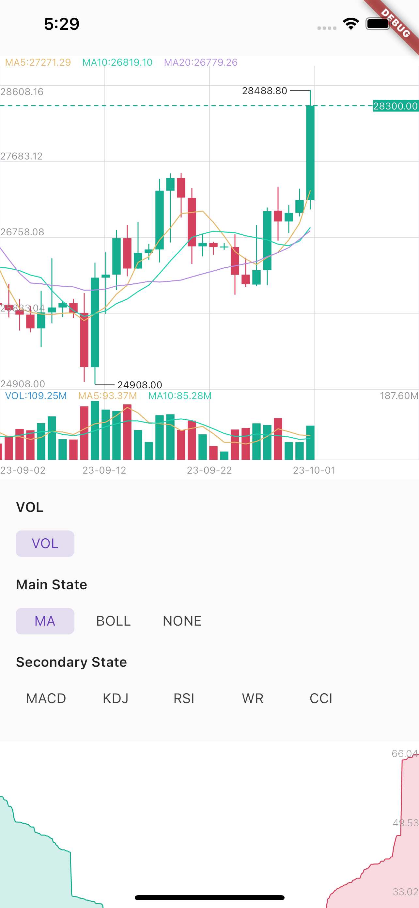
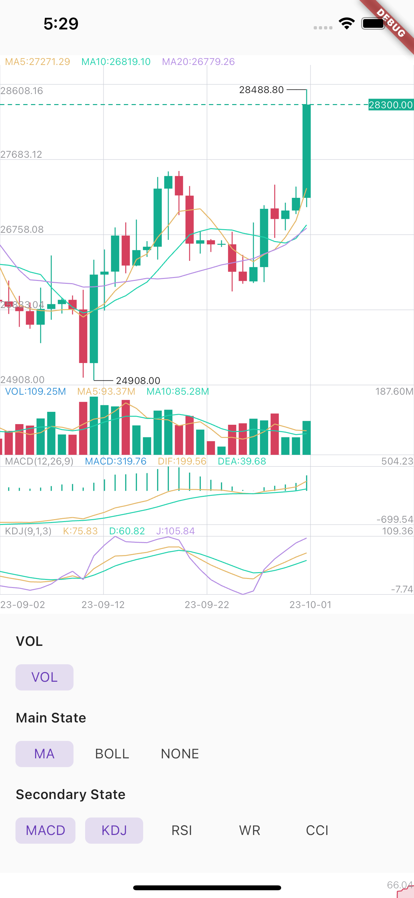

# k_chart
Maybe this is the best k chart in Flutter.Support drag,scale,long press,fling.And easy to use.

## display

#### image




## Getting Started
#### Install
k_chart:
    git:
      url: https://github.com/TrangLeQuynh/k_chart
```
#### Usage

**When you change the data, you must call this:**
```dart
DataUtil.calculate(datas); //This function has some optional parameters: n is BOLL N-day closing price. k is BOLL param.
```

use k line chart:
```dart
KChartWidget(
    chartStyle, // Required for styling purposes
    chartColors,// Required for styling purposes
    datas,// Required，Data must be an ordered list，(history=>now)
    mBaseHeight: 360, //height of chart (not contain Vol and Secondary) 
    isLine: isLine,// Decide whether it is k-line or time-sharing
    mainState: _mainState,// Decide what the main view shows
    secondaryStateLi: _secondaryStateLi,// Decide what the sub view shows
    fixedLength: 2,// Displayed decimal precision
    timeFormat: TimeFormat.YEAR_MONTH_DAY,
    onLoadMore: (bool a) {},// Called when the data scrolls to the end. When a is true, it means the user is pulled to the end of the right side of the data. When a
    // is false, it means the user is pulled to the end of the left side of the data.
    maDayList: [5,10,20],// Display of MA,This parameter must be equal to DataUtil.calculate‘s maDayList
    volHidden: false,// hide volume
    showNowPrice: true,// show now price
    isOnDrag: (isDrag){},// true is on Drag.Don't load data while Draging.
    onSecondaryTap:(){},// on secondary rect taped.
    isTrendLine: false, // You can use Trendline by long-pressing and moving your finger after setting true to isTrendLine property. 
    xFrontPadding: 100 // padding in front
),
```
use depth chart:
```dart
DepthChart(_bids, _asks, chartColors) //Note: Datas must be an ordered list，
```

#### Thanks
[gwhcn/flutter_k_chart](https://github.com/gwhcn/flutter_k_chart)
[OpenFlutter/k_chart](https://github.com/OpenFlutter/k_chart)

#### Other
Maybe there are some bugs in this k chart,or you want new indicators,you can create a pull request.I will happy to accept it and I hope we can make it better.
