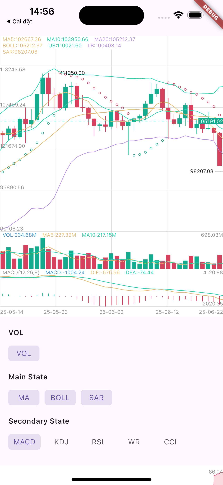
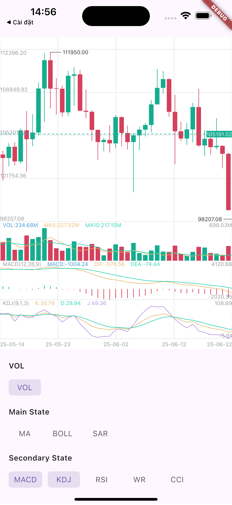
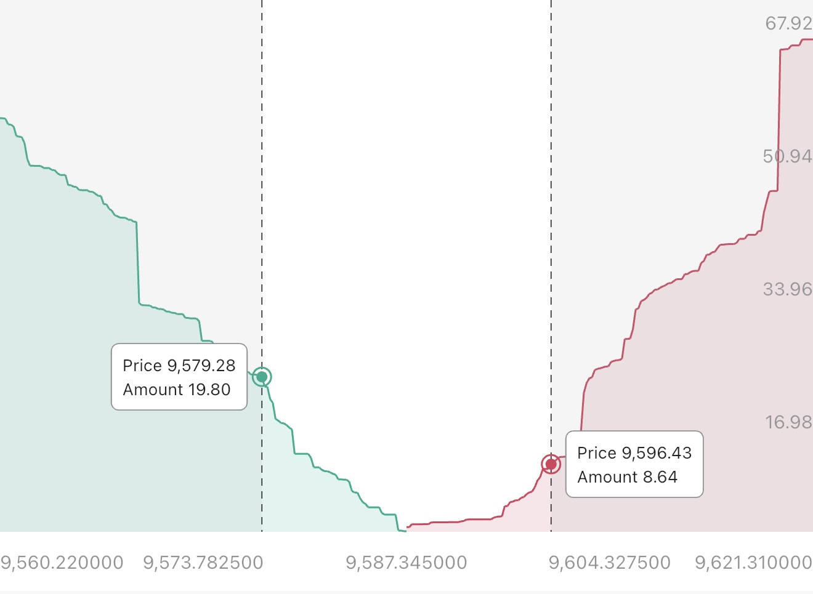

# K Chart Plus Package

## Feature

Maybe this is the best k chart in Flutter.Support drag,scale,long press,fling.And easy to use.

|Example1|Example2|
|:-------------------------:|:-------------------------:|
|  |  |

## Installation

First, add `k_chart_plus` as a [dependency in your pubspec.yaml file](https://flutter.dev/using-packages/).

```yaml
k_chart_plus: ^1.0.4
```

> If you don't want to support selecting multiple secondary states, you need to use: 
> ```
> k_chart_plus:
>    git:
>      url: https://github.com/TrangLeQuynh/k_chart_plus
>      ref: single #branch name
> ```
>


## Usage

### Use K line chart


**Indicator definitions (main & secondary)**. `indicatorStyle` and `calcParams` can be customized, subject to indicator support.

```dart
final List<MainIndicator> _mainIndicators = [
  MAIndicator(
    calcParams: [5, 10, 30, 60], // [Optional] Display of MA. Default is [5, 10, 30, 60]
  ),  
  EMAIndicator(
    calcParams: [5, 10, 30, 60], // [Optional] Display of EMA. Default is [5, 10, 30, 60]
  ),
  BOLLIndicator(),
  SARIndicator(),
];

final List<SecondaryIndicator> _secondaryIndicators = [
  MACDIndicator(),
  KDJIndicator(),
  RSIIndicator(),
  WRIndicator(),
  CCIIndicator(),
];
```

**Compute K chart data based on the selected indicators**

```dart
DataUtil.calculateAll(
  datas,
  _mainIndicators,
  _secondaryIndicators,
);
```

Paint K Chart

```dart
KChartWidget(
  datas, // Required，Data must be an ordered list，(history=>now)
  kchartStyle,  // Required for styling purposes
  kchartColors, // Required for styling purposes
  mBaseHeight: 350, // height of chart (not contain Vol and Secondary) 
  mSecondaryHeight: 80, // height of secondary chart
  isTrendLine: false, // You can use Trendline by long-pressing and moving your finger after setting true to isTrendLine property. 
  volHidden: _volHidden, // hide volume
  mainIndicators: _mainIndicators, // [mainIndicators] Decide what the main view shows
  secondaryIndicators: _secondaryIndicators, // [secondaryIndicators] Decide what the sub view shows
  fixedLength: 6,
  showNowPrice: true,// show now price
  timeFormat: TimeFormat.YEAR_MONTH_DAY,
  isOnDrag: (isDrag){}, // true is on Drag.Don't load data while Draging.
  xFrontPadding: 100 // padding in front
  detailBuilder: (entity) { // show detail popup 
    return PopupInfoView(
      entity: entity,
      chartColors: chartColors,
      fixedLength: 2,
    );
  },
),
```
### Use Depth chart



```dart
DepthChart(
  _bids, 
  _asks, 
  depthColors, // config the depth chart colors
  chartStyle: depthStyle, // config the depth chart style
  chartTranslations: const DepthChartTranslations(
    price: 'Price',
    amount: 'Amount',
  ),
) //Note: Datas must be an ordered list，
```

### Dark | Light Theme

`ChartColor` helped to set the color for the chart. You need to flexibly change according to your theme configuration to ensure UI.

>
> If you need to apply multi theme, you need to change at least the colors related to the text, border, grid and background color
>

```dart
final themeData = Theme.of(context);
final textColor = themeData.textTheme.bodyMedium?.color ?? Colors.grey;
final hintTextColor = themeData.disabledColor;

/// Configure the depth chart style
DepthChartStyle depthStyle = DepthChartStyle();
DepthChartColors depthColors = DepthChartColors(
  upColor: const Color(0xFF1EBB43),
  upFillPathColor: const Color(0x1F2AC07F),
  dnColor: const Color(0xFFFF476B),
  dnFillPathColor: const Color(0x1FE22127),
  selectBorderColor: themeData.dividerColor,
  selectFillColor: themeData.cardColor,
  defaultTextColor: hintTextColor,
  annotationColor: textColor,
  crossColor: textColor.withAlpha(220),
  barrierColor: const Color(0x12202020)
);

/// Configure the k chart style
KChartStyle kchartStyle = KChartStyle();
KChartColors kchartColors = KChartColors(
  bgColor: themeData.scaffoldBackgroundColor,
  kLineColor: const Color(0xff217AFF),
  kLineFillColors : const [
    Color(0x80217aff),
    Color(0x00217AFF),
  ],

  ma5Color: const Color(0xFFFFC634),
  ma10Color: const Color(0xff35cdac),
  upColor: const Color(0xFF1EBB43),
  dnColor: const Color(0xFFFF476B),
  volColor: const Color(0xff2f8fd5),
  volUpColor: const Color(0xFF1EBB43), //0x4D31BD65
  volDnColor: const Color(0xFFFF476B), //0x4DE93057
  nowPriceUpColor: const Color(0xFF1EBB43),
  nowPriceDnColor: const Color(0xFFFF476B),
  trendLineColor: const Color(0xFFF89215),
  selectBorderColor: themeData.dividerColor,
  selectFillColor: themeData.inputDecorationTheme.fillColor ?? Colors.white,
  gridColor: themeData.dividerColor,
  crossColor: textColor.withAlpha(220),
  crossTextColor: textColor,
  defaultTextColor: hintTextColor,
  maxColor: textColor,
  minColor: textColor,
);
```

### Thanks

[gwhcn/flutter_k_chart](https://github.com/gwhcn/flutter_k_chart)

[OpenFlutter/k_chart](https://github.com/OpenFlutter/k_chart)
